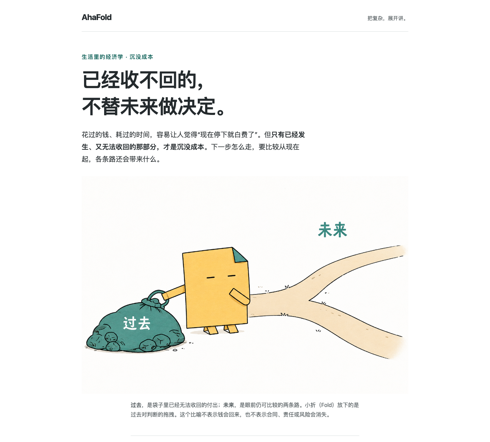

# AhaFold

**Turn complex ideas into illustrated explanations.**

[简体中文](README.zh-CN.md) · [Live introduction](https://agi-is-going-to-arrive.github.io/ahafold/?lang=en) · [Page source](index.html) · [See real examples](#see-what-you-get)

Turn a concept, article, or set of instructions into **an illustrated explanation you can read in a browser**. Tell your existing AI tool what you want to understand. AhaFold helps organize the words, pictures, and small interactions that make the answer easier to follow.

> **v0.1 public preview.** Install directly from this public GitHub repository. Codex has historical successful cases, Grok Build is partially verified, and Antigravity CLI has not completed acceptance. Current revisions are not verified across all three hosts.

<a id="see-the-result"></a>

## See what you get

[](examples/sunk-cost/index.html)

**“I bought the movie ticket. Do I still have to go?”**

AhaFold illustrates sunk cost with Fold putting down a heavy bag, then explains why irrecoverable past spending differs from future costs and benefits. The picture gives you a starting point; the conditions and exceptions stay in the explanation.

| What to explore | Actual output | What it demonstrates |
| --- | --- | --- |
| One concept | [Sunk cost](examples/sunk-cost/index.html) | An illustration, everyday examples, and analogy limits |
| Two similar ideas | [Recognition versus recall](examples/recognition-recall/index.html) · [Chinese edition](examples/recognition-recall/index.zh-CN.html) | A comparison; translated prose preserves the image |
| Changing numbers | [Compounding and time](examples/compounding/index.html) | Adjust conditions and inspect hypothetical results |
| A long set of rules | [Tool-library borrowing guide](examples/longform/library/illustrated.html) | Eleven sections, contents navigation, two real native illustrations |
| A technical process | [Booking retries](examples/longform/retries/index.html) | An English guide, timing, and failure conditions |
| Boundaries in code | [TypeScript → JSON](examples/longform/type-boundaries/index.html) | Chinese explanations, English terminology, original code |

Download or clone the repository and open these HTML files in a browser; GitHub's file view shows source. The [introduction](index.html) is bilingual; see the Pages setup below. Illustrations are existing real artifacts, not newly generated for this update. The long illustrated library guide was integrated by a maintainer, not produced in a fresh installed-host acceptance run of the revised skill. Each example's README records sources and edits.

## Start with three steps

### 1. Install in your project

You need Node.js **22.20.0+** and a normally signed-in Codex, Grok Build, or Antigravity CLI. Illustrations also require that tool's native image capability and available quota. No additional image API key is needed.

Already installed? Check `.agents/skills/ahafold/` and `.grok/skills/ahafold/` and preserve local changes first: the installer can overwrite a skill with the same name.

```sh
npx skills@1.5.23 add AGI-is-going-to-arrive/ahafold --skill ahafold --copy
```

Choose your current tool in the installer:

| Tool | Installer ID | Project installation path | Invocation |
| --- | --- | --- | --- |
| Codex | `codex` | `.agents/skills/ahafold/` | `$ahafold`; inspect with `/skills` |
| Grok Build | `grok` | `.grok/skills/ahafold/` | `/ahafold`; inspect with `/skills` |
| Antigravity CLI (`agy`) | `antigravity-cli` | `.agents/skills/ahafold/` | `/ahafold`; inspect with `/skills` |

Choose `antigravity-cli`, not the older IDE's `antigravity`; `grok-build` is not an installer ID. `--copy` uses file copies to avoid Windows symlink privileges. Start a new session after installation and check `/skills` for AhaFold.

<a id="use-it"></a>

### 2. Ask in ordinary language

```text
Use AhaFold to explain sunk cost to a beginner. Write one illustrated page in English.
```

You can also write `$ahafold` in Codex or `/ahafold` in the other two tools. If you are unsure what to ask, supply three things:

> **Who it is for + what to explain + the output language.**

For example: “Explain delegation versus dumping responsibility to a first-time manager, in English.” Illustrated HTML is the default. Add an image-only request, no-image preference, or call limit when you need one. No special prompt syntax to learn.

### 3. Open the page

The default output is `ahafold-output/<topic-slug>/index.html`, with original images in the adjacent `assets/` directory. Open it in a browser. Readers of a self-contained HTML file need no AI account, Node.js, or server. Reading and ordinary interactions make no model calls. Keep the originals for later edits and provenance checks.

## Twenty situations: copy a prompt and try it

These are **suggested uses, not twenty completed acceptance tests**. Supply the referenced file or material along with the request. Examples do not imply automatic access to unauthorized websites, cloud drives, or private files.

### Learning and everyday questions

<details>
<summary>Understand a concept — An everyday scene + the conditions that matter</summary>

```text
Use AhaFold to explain sunk cost to a beginner through a movie ticket they no longer want to use. Write an illustrated page in English and distinguish money that can still be recovered.
```

</details>

<details>
<summary>Tell two ideas apart — Side-by-side comparison + one example each</summary>

```text
Use AhaFold to explain recognition versus recall to a student. Compare multiple-choice and fill-in-the-blank questions in an illustrated English page.
```

</details>

<details>
<summary>Explain science to a child — A journey + where the analogy breaks</summary>

```text
Use AhaFold to explain the water cycle to a ten-year-old in English. Illustrate the journey of water and explain why a cloud is not a bag of water.
```

</details>

<details>
<summary>See how numbers change — An adjustable example + explicit assumptions</summary>

```text
Use AhaFold to explain time and compounding in English. Assume a principal of 100, a fixed annual rate of 5%, and annual compounding. Add a years control; state that taxes and fees are excluded and returns are hypothetical.
```

</details>

<details>
<summary>Understand a long article — An overview, then linked sections</summary>

```text
Use AhaFold to explain my supplied article.md to someone without background knowledge. Write in English: answer first, then illustrated sections. Preserve important conditions, exceptions, and numbers.
```

</details>

### Teams and work

<details>
<summary>Teach a new teammate a process — Steps + owners + completion conditions</summary>

```text
Use AhaFold to turn my supplied onboarding process into an illustrated English guide. Show who acts, what they do, what counts as done, and whom to contact when blocked.
```

</details>

<details>
<summary>Clarify a confusing rule — Distinct states + common misreadings</summary>

```text
Use AhaFold to explain these borrowing rules to a first-time tool-library visitor in English. Separate submitting a request, confirming a reservation, and collecting an item. Preserve return and cancellation conditions.
```

</details>

<details>
<summary>Compare two options — Shared assumptions; missing data stays visible</summary>

```text
Use AhaFold to compare my supplied options A and B in English. Use the same budget and headcount, explain when each fits, and mark missing data.
```

</details>

<details>
<summary>Show what changed — One example traced before and after</summary>

```text
Use AhaFold to compare my supplied old and new processes in English. Trace the same concrete example through both and mark changes, unchanged behavior, and new constraints.
```

</details>

<details>
<summary>Explain meeting decisions — Decisions / open questions / next steps</summary>

```text
Use AhaFold to explain these meeting notes in English. Separate decisions, open questions, and next steps. Do not turn discussed ideas into commitments.
```

</details>

### Writing and communication

<details>
<summary>Illustrate an article — Images and captions only</summary>

```text
Use AhaFold to make three Fold illustrations for my supplied article. Deliver only the images and captions, each explaining a different key idea. Do not rewrite the article.
```

</details>

<details>
<summary>Plan pictures first — An illustration plan; no image calls</summary>

```text
Use AhaFold to plan illustrations for this article without generating images yet. Explain where each belongs, what it teaches, and what Fold is doing.
```

</details>

<details>
<summary>Explain technology to family — A familiar situation + limits</summary>

```text
Use AhaFold to explain cloud backup versus file sync to a nontechnical family member in English. Use an accidentally deleted photo and show what each can and cannot guarantee.
```

</details>

### Technology and code

<details>
<summary>Explain an API to a teammate — A request path + important states</summary>

```text
Use AhaFold to explain an order request to a product teammate from this API description. Write in English; distinguish received, processing, and completed. Do not assume a timeout means failure.
```

</details>

<details>
<summary>Explain retry failures — A timeline + a concrete failure case</summary>

```text
Use AhaFold to explain from my supplied material why retrying a booking may duplicate an order. Write in English, show request and response timing, and preserve the conditions for idempotency keys.
```

</details>

<details>
<summary>Understand types and runtime — Explanation beside code + boundaries</summary>

```text
Use AhaFold to explain this TypeScript code that receives JSON. Write in English, preserve the original code, and distinguish compile-time checking, runtime validation, and type assertions.
```

</details>

### Revisions and control

<details>
<summary>Make it simpler — A focused rewrite; no new images</summary>

```text
Use AhaFold to rewrite the second paragraph of this page for a beginner in English. Keep its important conditions, the other content, and every existing image unchanged.
```

</details>

<details>
<summary>Translate text, keep the image — A new prose language; unchanged image bytes</summary>

```text
Use AhaFold to translate this HTML text into English and keep the original image. Explain its Chinese labels in an English caption without claiming the image text was edited.
```

</details>

<details>
<summary>Use precise diagrams only — A comparison with selectable text</summary>

```text
Use AhaFold to turn this glossary into an English HTML comparison. No character or raster images. Keep accurate definitions and one short example each.
```

</details>

<details>
<summary>Set an image budget — A call limit + honest incomplete status</summary>

```text
Use AhaFold to illustrate this material in English. Make at most two native image calls, including retries. If the budget runs out, deliver a readable draft and identify missing illustrations.
```

</details>


## Meet Fold

**Fold / 小折** is an apricot paper-page character with a teal folded corner. Fold performs an action that explains a relationship: putting down a bag, handing in a request, or following a path. Precise diagrams need no character when one would add nothing.

AhaFold draws on [Ian Xiaohei Illustrations](https://github.com/helloianneo/ian-xiaohei-illustrations) for illustrations that enact a conceptual step, and [visual-explainer](https://github.com/nicobailon/visual-explainer) for readable HTML delivery. It implements its own lightweight workflow with an independent character and original templates. Neither reference project needs to be installed first.

Images establish a scene and intuition; HTML/SVG carries selectable text, exact values, code, and changing state. Long guides start with an answer and overview, then expand into linked sections. Illustration coverage follows the prose and subject. Interaction is optional when a direct explanation is enough.

## Where it fits

Use it for learning concepts, illustrating articles, onboarding, explaining rules, comparing options, and explaining technical material you supply. You can request illustrations only, a plan only, or an image-free page.

It does not provide editable PPTX, complete vector illustration sources, automated repository audits, or automatic publishing. Generated facts, image labels, and analogies still require review. An output looking clearer does not establish that people learn faster from it.

Generation sends prompts and reference material to **your current tool's cloud service**, using that account and its quota. Cost may be unknown; a subscription does not imply unlimited generation. Missing images, 429 responses, authentication failures, or uncertain outcomes stop that image route. A readable draft can still be delivered with limitations stated. There is no silent provider switch, automatic API fallback, or removal of provider watermarks.

## What is implemented and verified

This is **historical installation-to-output coverage**, not renewed certification of every current revision. Native host probes, browser checks, and human comprehension are separate kinds of evidence.

| Combination | State | Scope and limits |
| --- | --- | --- |
| macOS / Codex | PASS | Bounded historical installed generation, editing, and multilingual cases passed; the revised illustrated workflow needs fresh acceptance. |
| macOS / Grok Build | PARTIAL | Native generation/reference/editing work; content, image alignment, and mobile reading failures remain in the evidence. |
| macOS / Antigravity CLI | BLOCKED | Historical429; later testing deferred. Complete workflow unverified. |
| Windows / Codex | NOT TESTED | No native Windows installation-to-output evidence. |
| Windows / Grok Build | NOT TESTED | Same limitation. |
| Windows / Antigravity CLI | NOT TESTED | Same limitation. |
| Linux / Codex | NOT TESTED | No Linux installation-to-output evidence. |
| Linux / Grok Build | NOT TESTED | Same limitation. |
| Linux / Antigravity CLI | NOT TESTED | Same limitation. |

Priorities: **repeat real-host acceptance against the current skill; fix or clearly bound long-guide reload focus; verify each fact and image relationship; observe first-time readers completing comprehension tasks.** Keep one skill without adding a service or extra configuration for distribution.

<details>
<summary>Test records and remaining evidence gaps</summary>

The reload repair was checked in an isolated checkout on 2026-09-12: type, package, installer, compact-page, and long-guide browser checks passed. Native no-JavaScript reload limitations remain separately recorded and are not counted as passed navigation. This pass made no new host image calls; browser CI does not recertify native-image support on Windows/Linux.

- [Installation and native acceptance](tests/validation.md): versions, call counts, and scope.
- [Focused Codex / Grok evaluation](tests/focus-validation.md): Chinese, English, mixed-language tasks, and actual failures.
- [Long-guide evaluation](tests/longform/results.md): six no-image sessions; all60 required facts were consistent across the three Codex outputs, versus56 of60 for Grok. This does not establish illustrated long-form authoring.
- [Illustrated-guide checks](tests/longform/illustrated-results.md): a maintainer-integrated two-image example and historical reload-focus issues. Files have since changed; old results do not automatically describe the current version.
- [Long-guide behavior checks](tests/longform/README.md) and [acceptance cases](tests/cases.md): deterministic checks cannot prove another OS's OAuth image generation or lower human learning costs.

Earlier Windows/Ubuntu long-form CI failed on reload focus. The [reload repair and revised acceptance boundary](tests/longform/README.md#reload-repair-and-acceptance-boundary-2026-09-12) distinguish strict JavaScript-enabled keyboard continuation from a separately reported no-JavaScript browser limitation. Historical failed results remain unchanged. Check actual results for the current commit rather than carrying forward an older green status. Without a human comparison study, do not claim better outcomes than the reference projects.

</details>

<details>
<summary>Illustration counts and host differences</summary>

A short explanation may need one picture. Longer explanations start from roughly one per1000 Chinese/CJK characters or600 English words of generated prose, then adjust for distinct mechanisms, difficulty, and existing coverage. Combine both for mixed-language prose and recount after the full draft. Code, tables, appendices, captions, and image data do not inflate the count. Explicit counts and authorized budgets take precedence; there is no universal cap.

Codex's preferred image target is `gpt-image-2.5`: plan integrated headings,
annotations and conceptual charts when useful. Grok Build and Antigravity CLI
default to simpler native scenes with no text or a few short labels, plus precise
HTML/SVG. These are authoring strategies, not a measured quality ranking.
Long prose, executable code, authoritative formulas/data and changing charts stay
editable. Important image text also remains selectable in the page. Explicit
no-image and precision-only requests remain supported; Fold and interaction are
used when they help. You can also request an illustration only.

The target does not force a native backend. As checked on 2026-09-12, official
[image prompting guidance](https://developers.openai.com/api/docs/guides/image-prompting)
documents 2.5 API variants, while [Codex image generation](https://developers.openai.com/codex/image-generation)
still names `gpt-image-2`. AhaFold selects a requested model only when the live native
schema supports it, and reports an undisclosed backend honestly. Subscription login
alone does not verify a specific model or quota; no API key or reasoning-model
configuration change is needed for the native workflow.

</details>

## Installation, updates, and distribution

**npx installation is already available; a separate npm package is unnecessary.** `npx` runs the pinned `skills` installer, which retrieves `skills/ahafold/` from GitHub. The repository is public; cloning or installing the skill requires no GitHub login.

To choose one tool directly, for example Codex:

```sh
npx skills@1.5.23 add AGI-is-going-to-arrive/ahafold --skill ahafold --agent codex --copy
```

Replace `codex` with `grok` or `antigravity-cli`. The **installer version** is pinned; the skill follows the repository's default branch, so this does not freeze the AhaFold version. To freeze the skill as well, use the preview tag:

```sh
npx skills@1.5.23 add https://github.com/AGI-is-going-to-arrive/ahafold/tree/v0.1.0-preview.1 --skill ahafold --copy
```

The preview retains the host-support limits above. `owner/repo@tag` is not tag syntax in this installer; use the `/tree/<tag>` URL.

For a local clone, replace the repository name with its quoted directory. You can also copy **the entire `skills/ahafold/` folder**, including `references/`, `assets/`, and `LICENSE`, to the appropriate project path. Skill users do not need `pnpm install`. These instructions are project-scoped; global installation is outside the verified scope.

Preserve local edits before updating with the same command. After inspecting the directories, remove only this skill from the current project with:

```sh
npx skills@1.5.23 remove ahafold -y
```

Codex and Antigravity CLI share the `.agents` copy; removal affects both. Other skills and `ahafold-output/` remain intact. The installer may leave a shared copy for other detected hosts, so inspect the actual directories. Never put credentials in commands or issue reports.

<details>
<summary>Maintainers: introduction page and checks</summary>

The root [index.html](index.html) is a standalone bilingual introduction that opens locally. It reuses existing native illustrations and supports language switching, scenario filters, and prompt copying. Ordinary browsing makes no model calls.

The [Pages workflow](.github/workflows/pages.yml) publishes only the introduction, curated examples, and license notices when manually dispatched. It does not upload `tests/`, `output/`, or the whole repository. GitHub Pages must be available and configured to use GitHub Actions. Verify the actual deployment result. The public preview is distributed from GitHub; no separate AhaFold npm package is published.

```sh
pnpm install --frozen-lockfile
pnpm exec playwright install chromium
pnpm run typecheck
pnpm run check:package
pnpm run test:checks
pnpm run test:install
pnpm run test:examples
pnpm run test:longform
```

These are maintainer checks, not steps for using the skill. Real-host acceptance is separate.

</details>

## License and contributions

Original skill, templates, scripts, and project-held asset rights use [MIT](LICENSE). [NOTICE.md](NOTICE.md) records inspiration, AI-image provenance, and rights limits. Preserve original images and provider markings.

Contribute scenarios with inputs and expected outputs, clearer wording, and dated compatibility records. Do not submit private material, tokens, or raw session logs.

## Acknowledgments

- [Ian Xiaohei Illustrations](https://github.com/helloianneo/ian-xiaohei-illustrations), for the approach of making an illustration express a meaningful conceptual action.
- [visual-explainer](https://github.com/nicobailon/visual-explainer), for the approach of presenting visual explanations as readable HTML.
- [Linux DO](https://linux.do/), with thanks to the community for its discussions and sharing.
