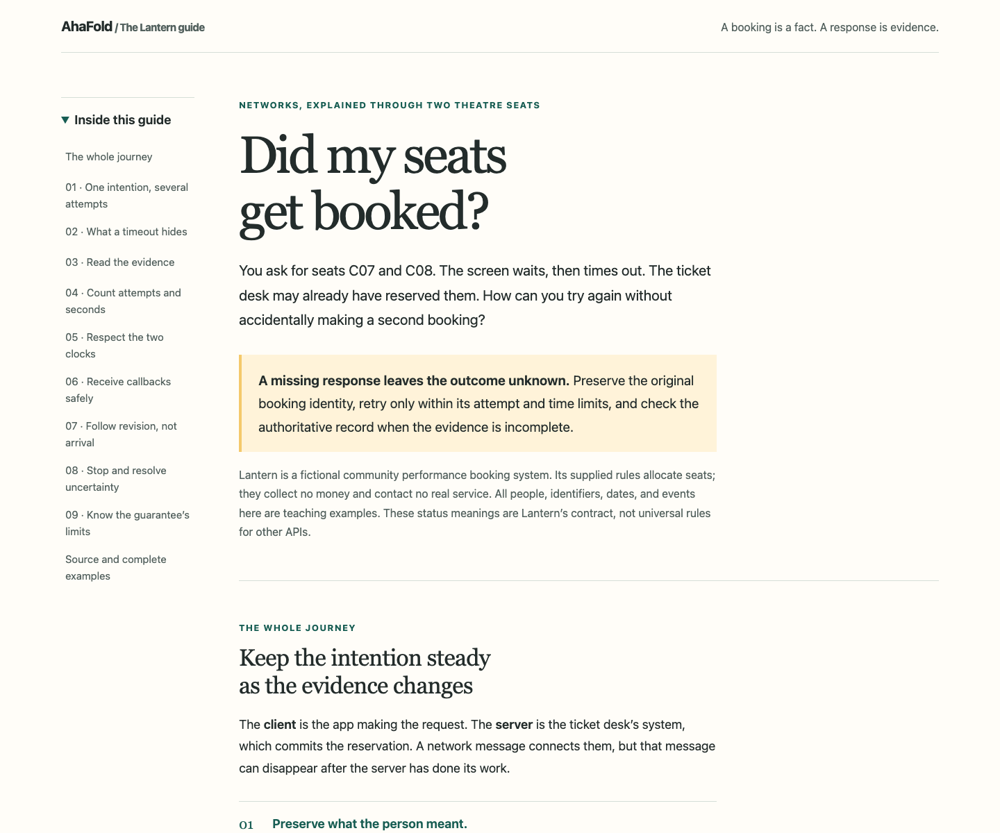
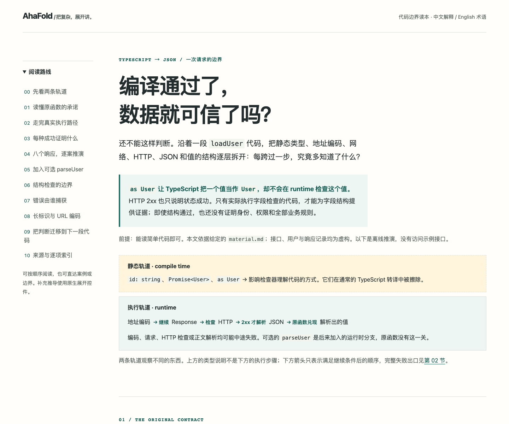

# Long explanations · 长篇图解

[English README](../../README.md) · [中文说明](../../README.zh-CN.md)

The illustrated library guide now combines two real current-Codex native Fold
scenes with11 linked sections, precise rules, tables and worked examples. It is a
maintainer enrichment of the existing guide. The three earlier installed-host
guides remain as Chinese, English and mixed-language **no-image controls**; their
zero-image runs did not validate the illustrated long-form workflow.

工具借用图文版把两幅当前 Codex 原生生成的小折场景与11节正文、精确规则、表格和算例结合，
属于维护者对已有长文的增补。此前三份安装后成品继续作为中文、英文和混排的**无图对照**；
那些零图片调用的测试没有验证完整图文长文链路。

| 工具借用 · 11 sections | Booking retries · 11 sections | TypeScript → JSON · 10 sections |
| --- | --- | --- |
|  |  |  |
| [Notes / 说明](library/README.md) | [Notes / 说明](retries/README.md) | [Notes / 说明](type-boundaries/README.md) |

The original `index.html` pages are unchanged Codex outputs. Notes link to separately reviewed Grok
variants; the Grok retry page remains labelled Chinese. The [illustration record](library/illustration-provenance.json)
separately records2new image calls, cumulative11/15. Corrections do not change
raw-host results. See [sources and hashes](../../tests/longform/curation.json),
[dated evaluation](../../tests/longform/results.md), and [explicit language prompts](../../README.md#use-it).

原有 `index.html` 保留 Codex 原始输出；说明中另列 Grok 修订版，其中重试页继续标为中文。
[配图记录](library/illustration-provenance.json)单独记录本批2次调用，累计11/15。
修订不改变原始宿主结论。[来源与哈希](../../tests/longform/curation.json)、
[评估结果](../../tests/longform/results.md)和[语言提示词](../../README.zh-CN.md#如何使用)分别可查。

The [original long-form template](../../skills/ahafold/assets/longform.html) uses
methods studied in the local visual-explainer [source comparison](../../tests/longform/README.md).
No matched output-quality benchmark is claimed. Maintainer check: `pnpm run test:longform`.

[原创长篇模板](../../skills/ahafold/assets/longform.html)参考了本地 visual-explainer 的
[源码方法](../../tests/longform/README.md)，未宣称同题生成质量基准测试结论。
维护者检查：`pnpm run test:longform`。
