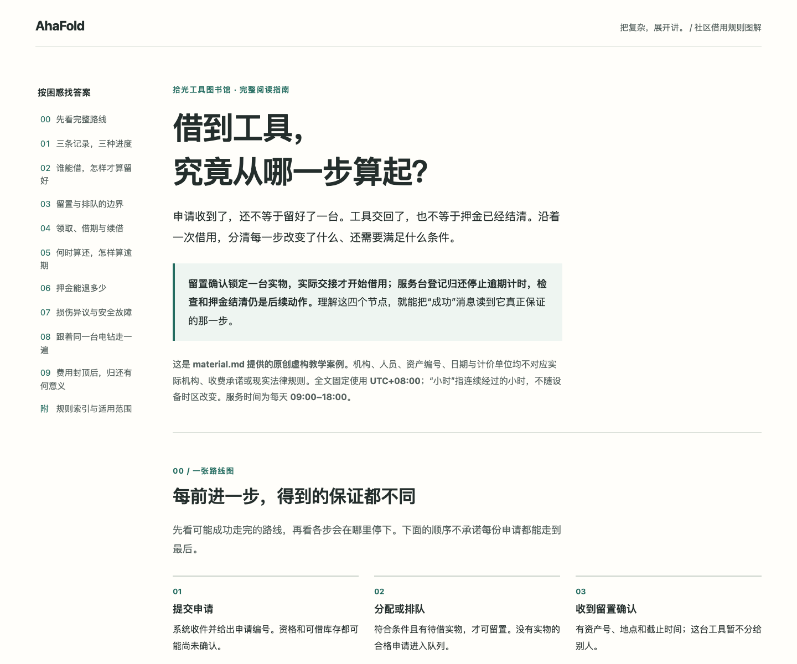

# Long explanations · 长篇图解

[English README](../../README.md) · [中文说明](../../README.zh-CN.md)

Three complete guides from fresh AhaFold installations on macOS: Chinese,
English, and Chinese with English terms/code. They use 10–11 linked sections,
local diagrams and worked examples. All authoring runs used **0 image calls**;
Fold and new illustrations are optional.

三份成品来自 macOS 上全新安装后的 AhaFold 会话，分别展示中文、英文、中英混排的长篇。
它们用 10–11 个可跳转章节、局部图解与算例组织材料；全部生成会话均为 **0 次图片调用**，
小折与新插画按需使用。

| 工具借用 · 11 sections | Booking retries · 11 sections | TypeScript → JSON · 10 sections |
| --- | --- | --- |
|  |  |  |
| [Notes / 说明](library/README.md) | [Notes / 说明](retries/README.md) | [Notes / 说明](type-boundaries/README.md) |

Default pages are unchanged Codex outputs. Notes link to separately reviewed Grok
variants; the Grok retry page remains labelled Chinese. Corrections do not change
raw-host results. See [sources and hashes](../../tests/longform/curation.json),
[dated evaluation](../../tests/longform/results.md), and [explicit language prompts](../../README.md#use-it).

默认页保留 Codex 原始输出；说明中另列 Grok 修订版，其中重试页继续标为中文。
修订不改变原始宿主结论。[来源与哈希](../../tests/longform/curation.json)、
[评估结果](../../tests/longform/results.md)和[语言提示词](../../README.zh-CN.md#如何使用)分别可查。

The [original long-form template](../../skills/ahafold/assets/longform.html) uses
methods studied in the local visual-explainer [source comparison](../../tests/longform/README.md).
No matched output-quality benchmark is claimed. Maintainer check: `pnpm run test:longform`.

[原创长篇模板](../../skills/ahafold/assets/longform.html)参考了本地 visual-explainer 的
[源码方法](../../tests/longform/README.md)，未宣称同题生成质量基准测试结论。
维护者检查：`pnpm run test:longform`。
