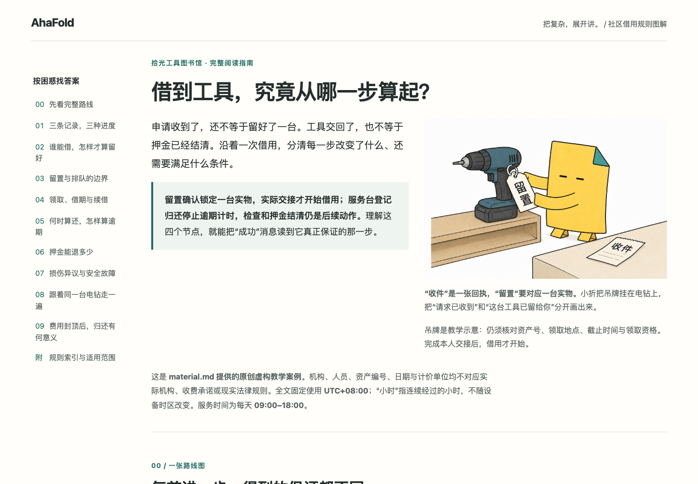

# Borrowing from a tool library · 工具借用规则

[All long guides / 全部长篇](../README.md)

[Illustrated guide / 图文版](illustrated.html) · [Codex no-image original / Codex 无图原版](index.html) · [Reviewed Grok variant / Grok 修订版](grok-reviewed.html)

The illustrated edition adds two real current-Codex native Fold images to the
existing 11-section guide. The opening image explains receipt versus reservation;
the second sits in the return chapter and distinguishes recorded return from
inspection. Original prose and four tables remain intact. Each caption repeats
the short image labels and preserves the exact rules' boundaries.

图文版在原有11节长文中加入两幅当前 Codex 原生生成的小折场景：开头解释收件与留置，
归还章节区分已记归还与待检查。原正文与四张表完整保留，图注重复短标签并说明精确规则的边界。

The two images are a historical integration/byte-preservation example, not the
recommended image count for an 11-section guide. New authoring uses the
[length-adaptive planning rule](../../../skills/ahafold/references/longform.md#determine-the-count-from-the-generated-content).
This saved example has not been regenerated as an acceptance case for that rule.

此处两图是此前图文编排与原图保真示例，不代表11节长文的推荐配图数量。
新生成任务采用[随正文长度动态规划的规则](../../../skills/ahafold/references/longform.md#determine-the-count-from-the-generated-content)，
本页尚未按新数量规则重新生成验收。

This is maintainer integration, not a new fresh installed-host authoring run.
It used **2 image calls**, bringing the cumulative budget use to **11/15**.
Both1536×1024 PNGs are preserved byte-for-byte in `assets/` and embedded in the
HTML. [Prompts, reference roles, hashes and limitations](illustration-provenance.json)
record the native generation. No visible watermark was observed; provider metadata
and any invisible provenance were retained.

这是维护者编排，不算新的安装后宿主独立生成测试。本批 **2次图片调用**，累计 **11/15**。
两张1536×1024 PNG原字节保存在 `assets/` 并内嵌进HTML。
[提示词、参考图角色、哈希与限制](illustration-provenance.json)可查。
未观察到可见水印；供应商元数据与可能的隐形标记保持原样。

An 11-section Chinese guide to fictional community lending rules: inventory,
applications, loans, waiting lists, deadlines, renewals and deposit calculations.
Its sole factual source is the supplied [24-rule material](../../../tests/longform/inputs/library.md).

一份 11 节的中文长篇，解释虚构社区的实物、申请、借用、排队、期限、续借及押金计算。
唯一事实来源为给定的[24 条规则](../../../tests/longform/inputs/library.md)。

The no-image `index.html` is the unchanged 2026-09-05 installed Codex output. Grok's reviewed
figure clarifies that the 10-01 → 10-02 collection window and 10-03 → 10-10 loan
are independent examples; handover must precede its own valid hold deadline.
Both authoring runs used **0 image calls**. Fold was not needed.

无图 `index.html` 保留 2026-09-05 的 Codex 安装后原始输出。Grok 修订图明确：10-01 → 10-02 的领取窗口
与 10-03 → 10-10 的借期属于独立案例；交接须早于自身有效留置截止。两次生成均为 **0 次图片调用**，未使用小折。

[Raw Codex / 原始 Codex](../../../tests/longform/artifacts/codex-library/index.html) ·
[Raw Grok / 原始 Grok](../../../tests/longform/artifacts/grok-library/index.html) ·
[Changes and hashes / 修改与哈希](../../../tests/longform/curation.json) ·
[Evaluation / 评估](../../../tests/longform/results.md)

The reviewed figure does not upgrade the raw Grok result. / 修订图不升级原始 Grok 测试结论。
